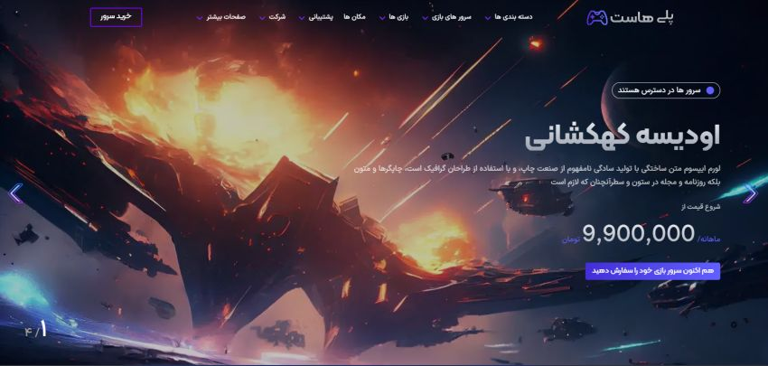
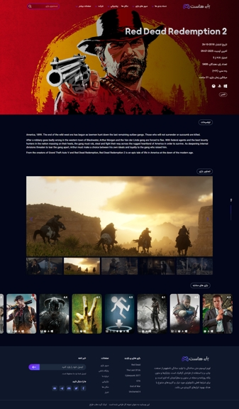

# وب‌سایت نمونه کار: Play host
<div style="display: flex; justify-content: space-between;">
  
  
</div>

این یک وبسایت معرفی بازی میباشد که به عنوان نمونه کار طراحی شده است.

## 🔗 لینک دمو (با vpn وارد شوید)

<a href="https://amirrezazade.github.io/game-site/" t>مشاهده وب‌سایت به صورت زنده</a>


---

## جزئیات سایت

- امکان جستجوی بازی با اسم , ژانر , امتیاز ,  سال انتشار و پلتفرم
- توضیحات و تصاویری از محیط بازی
- افکت  ها و انیمیشن های زیبا
---

## 🛠️ تکنولوژی‌های استفاده شده

- rawg api  : برای دریافت داده ها و اطلاعات بازی ها 
- tailwind css : ...استایل‌دهی و طراحی ظاهری سایت، شامل انیمیشن‌ها و ترنزیشن‌ها و
- SwiperJS :برای ایجاد اسلایدر های حرفه ای و زیبا 
- aosJS :برای انیمیشن ها اسکرول 


## 🚀 نحوه راه‌اندازی پروژه

1. ریپازیتوری را کلون کنید:
   
   ```bash
   https://github.com/amirRezazade/game-site.git
